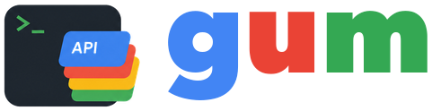
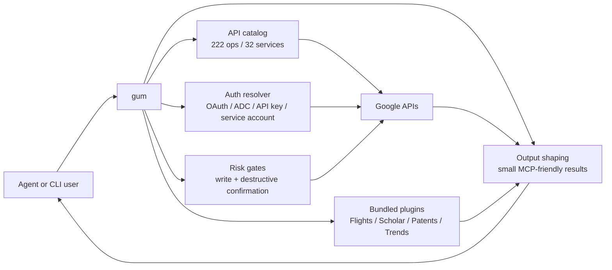

# gum

<p align="center">
  
</p>

<p align="center">
  
  
  
  
</p>

Most agents can write code. Giving them access to Google APIs is the risky part.

The hard part is not sending HTTP. The hard part is finding the right method,
getting the right OAuth scope, trimming huge JSON responses, and stopping a bad
prompt from turning into a real delete.

gum is a single binary that gives agents and humans a safer control surface for
Google APIs. It runs as a terminal CLI and as an MCP stdio server. It carries an
embedded Google API catalog, local auth helpers, compact output shaping, and
confirmation gates for risky writes.

Use gum when you want an agent to inspect Gmail, Drive, Docs, Sheets, Calendar,
Admin, or other Google services without pasting tokens into prompts or writing a
custom tool for each endpoint.

Use it only with Google accounts, projects, and APIs you own or are authorized
to operate.

## What gum covers

gum v1.0 ships with 222 operations across 32 services.

| Surface | Examples | Auth |
| --- | --- | --- |
| Google Workspace and Google APIs | Gmail, Calendar, Drive, Docs, Sheets, Slides, Tasks, Admin, Vault, Chat, Meet, Classroom, Forms, Apps Script, People, Photos, YouTube, Search Console, Google Ads, Maps, Custom Search | OAuth, ADC, API key, service account, or Google Ads developer token |
| Bundled plugin services | Google Flights, Google Scholar, Google Patents, Google Trends, YouTube transcripts | Plugin-managed setup, with separate trust and sandbox checks |

The Google API path is for accounts and projects you control. The plugin path is
for useful Google-adjacent services that do not fit the normal OAuth catalog
model.



## Why this is different

Without gum, an agent usually gets one of two bad choices:

- A giant tool list, where every Google method burns context before the task
  starts.
- A raw HTTP escape hatch, where the agent has to infer scopes, paths, request
  bodies, pagination, and delete safety on the fly.

gum keeps the first screen small. The MCP server starts with 29 tools: 9
meta-tools, 18 common convenience tools, and 2 skill helpers. Everything else is
found through `gum.search_apis` and loaded only when needed.

The current release-gate benchmark uses 200 fixture calls against a spec-scale
naive baseline. In that test, gum reduced MCP-layer tokens by 83.39%:

| Path | Tool-list tokens | Response tokens | Total |
| --- | ---: | ---: | ---: |
| Naive full-catalog MCP server | 406,638 | 140,065 | 546,703 |
| gum shaped MCP surface | 8,804 | 82,000 | 90,804 |

This measures MCP tool definitions plus API response payloads with the
`cl100k_base` tokenizer. It is not a billing promise and it is not a latency
claim. The point is simpler: the agent sees less catalog noise and less raw JSON
while still getting the operation it asked for.

## How OAuth works

OAuth is Google's consent flow. A Google Cloud project owns an OAuth client, the
consent screen, API enablement, quota, and verification state. gum v1.0 asks you
to use your own Desktop OAuth client because that keeps those controls in your
project.

The flow is:

1. You create a Google Cloud project and Desktop OAuth client.
2. You enable the APIs you want gum to call.
3. You register the client once with `gum auth use-oauth-client`.
4. `gum login --service <name>` opens your browser and stores the resulting
   refresh token in the OS keychain.
5. CLI, MCP, and agent calls reuse that local credential without putting tokens
   in prompts.

Not every Google surface uses the same auth shape. Some operations use OAuth.
Some use ADC, API keys, service accounts, or Google Ads developer tokens. The
bundled plugin services, such as Flights and Scholar, use their own setup path
because they are not normal Google API catalog endpoints.

## Add gum to an agent

Install the bundled skills and MCP server config in one step:

```shell
gum setup --dry-run
gum setup --target all --features skills,mcp --yes
gum agents install --target all --features skills,mcp --dry-run --format json
```

Use `--target codex`, `claude`, `cursor`, or `gemini` to install for one
agent. Use `--scope project` when you want repo-local MCP config. The default
writes skill files plus a stdio MCP entry that runs `gum mcp --stdio`.

Run the dry run first. It prints the exact files gum would write. Reruns are
safe: MCP config files are merged, and existing skill files are left alone
unless you pass `--force`.

## At a glance

| Need | Use |
| --- | --- |
| Explore Google API operations | `gum search`, `gum describe` |
| Call read/write/destructive APIs | `gum read`, `gum write`, `gum destructive` |
| Agent access over MCP | `gum mcp --stdio` |
| Guided setup and diagnostics | `gum setup`, `gum doctor` |
| Google auth | Your Google OAuth client, ADC, API key, or service account |
| Secrets for agent workflows | [HASP](https://github.com/gethasp/hasp) for brokered local secret access |
| Install and release downloads | Release archives, install script, or Homebrew tap |

## Install

Public release assets are published on the
[GitHub releases page](https://github.com/ehmo/gum/releases). Download the
archive for your OS and CPU, then verify it with `checksums.txt`.

```shell
tar -xzf gum_<version>_<os>_<arch>.tar.gz
install -m 0755 gum ~/.local/bin/gum
gum --version
```

After the public release is published, install with:

```shell
curl -fsSL https://raw.githubusercontent.com/ehmo/gum/main/install.sh | bash
```

Pin a version with `GUM_VERSION=vX.Y.Z`.

Homebrew:

```shell
brew tap ehmo/tap https://github.com/ehmo/homebrew-tap
brew install ehmo/tap/gum
gum setup --dry-run
gum doctor
```

Use the qualified formula name. Plain `brew install gum` installs
Charmbracelet's `gum`, which is a different CLI.

The public repo also includes `Formula/gum.rb` for people who want to tap this
repo directly and build from source. The `ehmo/tap/gum` formula installs from
the release archives and is the normal Homebrew path.

The source tree uses a Go module under `apps/gum`, so this release does not
document a `go install` path. Use release archives for a stamped binary.

## First Proof

For Gmail, Calendar, Drive, Docs, Sheets, Slides, Tasks, and most Workspace
APIs, gum needs a Google OAuth client from your Google Cloud project. Google
uses that client to show the consent screen and issue your local refresh token.

1. Create a Google Cloud project.
2. Configure an OAuth consent screen.
3. Create an OAuth client ID with application type `Desktop app`.
4. Enable the Google APIs you plan to call.
5. Store the client in gum:

```shell
printf '%s' "$GOOGLE_OAUTH_CLIENT_SECRET" \
  | gum auth use-oauth-client --client-id "$GOOGLE_OAUTH_CLIENT_ID" --secret-stdin
```

Authorize a small Workspace scope set:

```shell
gum login --service gmail,calendar
gum doctor
gum read gmail.users.messages.list --args '{"userId":"me","maxResults":5}'
```

For exact API setup, see [docs/auth-guides](docs/auth-guides/README.md).

## Keep Secrets Out of Prompts

gum stores Google refresh tokens in your OS keychain. It also accepts OAuth
client secrets through stdin. That covers gum's own auth path.

Your agent may still need other secrets: API tokens for tests, deploy keys,
staging credentials, or service-specific config. Use
[HASP](https://github.com/gethasp/hasp) for that job. HASP is a local secret
broker for coding agents. It stores secrets in an encrypted vault, gives a
command only the values it is allowed to use, and keeps managed secret values
out of the agent's prompt.

Install HASP:

```shell
brew tap gethasp/homebrew-tap
brew install hasp
hasp setup
```

Run gum work through a HASP grant when a task needs both Google API access and
non-Google secrets:

```shell
hasp app connect gum-work --cmd 'gum doctor' --install=never
hasp run --project-root . \
  --target gum-work \
  --grant-project session \
  --grant-secret session \
  -- gum doctor
```

Use three rules:

- Put Google OAuth client secrets into gum with `--secret-stdin`, not in chat.
- Put project and deploy secrets into HASP, not in `.env` files or prompts.
- Give agents short-lived HASP grants for the command they need to run.

See [docs/hasp.md](docs/hasp.md) for the gum + HASP workflow and the safety
checklist.

## Which Auth Path Should I Use?

| Use case | Path | Setup |
| --- | --- | --- |
| Gmail, Calendar, Drive, Docs, Sheets, Slides, Tasks, YouTube, People, Photos, Chat, Classroom, Meet, Apps Script, Admin, Vault, Search Console, Google Ads | BYO OAuth | `gum auth use-oauth-client`, then `gum login --service <name>` |
| Automation in Google Cloud | ADC | Set `GOOGLE_APPLICATION_CREDENTIALS` or use a gcloud ADC cache |
| Maps and Custom Search | API key | `gum auth use-api-key --stdin` |
| Service-account variants | Service account | `gum auth use-service-account <key.json>` |
| Google Ads | BYO OAuth plus developer token | `gum auth use-ads-developer-token`, then `gum login --service googleads` |

## MCP Setup

Use setup when you want gum to write common MCP client config files:

```shell
gum setup --target all --features skills,mcp --dry-run
gum setup --target all --features skills,mcp --yes
```

Run the local server directly:

```shell
gum mcp --stdio
```

Add this server to your MCP client config:

```json
{
  "mcpServers": {
    "gum": {
      "command": "gum",
      "args": ["mcp", "--stdio"]
    }
  }
}
```

Use an absolute binary path if another `gum` command is installed on your
machine. The Charmbracelet project also uses the name `gum`.

gum exposes a compact meta-tool surface plus selected convenience tools at
startup. The meta-tools let clients search, describe, read, write, confirm
destructive actions, run bounded code, inspect cache/gain state, and poll
long-running work without loading the full catalog into context. The server
also exposes `skills_list` and `skills_get` so MCP clients can load the current
agent guidance from the installed binary. Use `gum mcp --stdio --help`,
`gum skills list`, and `gum describe <op_id>` for the exact shipped surface.

More client snippets are in [docs/mcp-client-setup.md](docs/mcp-client-setup.md).

## CLI Basics

```shell
gum search "gmail messages"
gum describe gmail.users.messages.list
gum read gmail.users.messages.list --args '{"userId":"me","maxResults":5}'
gum write <op_id> --args '<json>'
gum destructive <op_id> --args '<json>'
gum doctor --format=json
```

Run `gum init --target claude-code` to patch an MCP config and write a local
`GUM.md` operator note. It shows the diff before it edits files unless you pass
`--yes`. New installs should start with `gum setup`; `gum init` remains for
the older direct Claude/Cursor patch flow.

## Troubleshooting

### `AUTH_REQUIRED` or `SCOPE_MISSING`

The active credential cannot satisfy the operation.

```shell
gum auth status
gum login --service gmail,calendar
gum auth probe --scopes gmail.readonly
```

If gum says a BYO OAuth client is missing, create a Google Desktop OAuth client
and run:

```shell
printf '%s' "$GOOGLE_OAUTH_CLIENT_SECRET" \
  | gum auth use-oauth-client --client-id "$GOOGLE_OAUTH_CLIENT_ID" --secret-stdin
```

If gum says a service needs product setup, OAuth worked but Google rejected the
request for a service-specific reason. Examples include Chat app installation,
Photos Library app access, Search Console property verification, and Google Ads
developer-token approval.

### `RATE_LIMITED`

Google returned HTTP 429 or a local rate-limit bucket ran out. gum retries
transient 429 responses with jittered backoff. Persistent 429 means the Google
project quota is too low.

Lower request concurrency, retry later, or raise quota in Google Cloud Console.

### MCP Client Does Not See Tools

1. Run `gum mcp --stdio --help`.
2. Use an absolute binary path in the MCP config.
3. Restart the MCP client. Tool registration happens at session start.
4. Check the client's stderr log for handshake errors.

### Destructive Confirmation Fails

Destructive tokens are single-use. Run the command once without `--confirmed`
to get a fresh `confirmation_token`, then retry with:

```shell
gum destructive <op_id> --confirmed --token <confirmation_token> --args '<json>'
```

## Development

```shell
cd apps/gum
go test ./...
```

Useful release gates:

```shell
make test-matrix
make coverage-floor
go vet ./...
```

The embedded catalog is generated under `apps/gum/internal/embedded`:

```shell
cd apps/gum
go run ./cmd/gen-catalog -out internal/embedded/catalog.json
```

## Repo Layout

```text
apps/gum/                 Go module for the CLI and MCP server
apps/gum/cmd/gum/         Cobra entry point
apps/gum/internal/auth/   BYO OAuth, ADC, API key, service account auth
apps/gum/internal/mcp/    MCP server presentation layer
apps/gum/internal/dispatch/ Shared dispatch kernel
docs/auth-guides/         Public Google credential setup guides
docs/mcp-client-setup.md  Public MCP client setup
docs/                     Public auth, MCP, catalog, plugin, and test references
```

## Security

See [SECURITY.md](SECURITY.md).

## License

gum is licensed under FSL-1.1-ALv2. Each release becomes available under
Apache License 2.0 on the second anniversary of that release date. See
[LICENSE](LICENSE).
